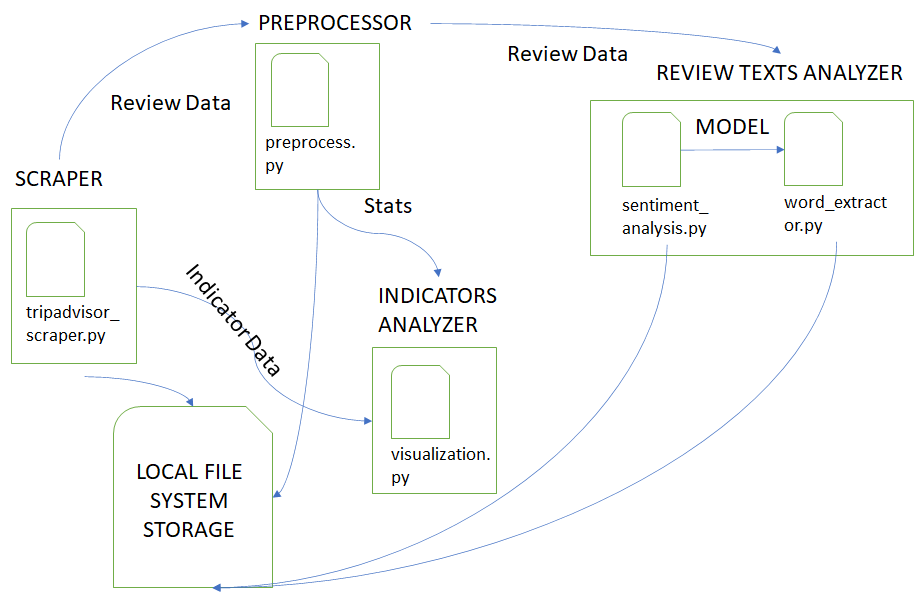

# Scraping and Analysis of TripAdvisor Data #

This project does the following: 
(1) Perform scraping of Tripadvisor reviews.
(2) Perform sentiment analysis.
(3) Extract relevant emotive words of Tripadvisor reviews.
(4) Perform clustering and visualisation of Singapore attraction types based on review, rating and quantity.

## Architecture ##

This project presents a data analytics pipeline that analyses Tripadvisor data to understand different attraction types 
based on their quantity, reviews, and ratings. There are four components of the pipeline: Scraper, Preprocessor, Review Text Analyzer, and 
Indicators Analyzer. Review Text Analyzer comprises of two small units: sentiment analyzer, and word extractor. Below, each component
is discussed in detail:



### Scraper ###
Scraper scrapes information from the Tripadvisor website. There are two types of data scraped. Indicators and reviews. 

Indicators are the general characteristics of an attraction. They are provided in the list of attractions in a region 
(e.g. https://www.tripadvisor.com.sg/Attractions-g294265-Activities-a_allAttractions.true-Singapore.html). They include 
 the name of the place, the link to the reviews, the average number of reviews, geocoordinates, the type of attraction, 
 and ratings. 
 
 The second type of data is reviews. Reviews are left by visitors after visiting an attraction. 
 It can be positive or negative.
 
 Note on scraping: Scraping is based on Tripadvisor website format in 2019. If format changes, the code may not work.

### Analyser ###
There are two analyser. Review text analyser, and indicators analyser. Review text analyser attempts to extract sentiments and 
relevant emotive words out of positive and negative reviews of an attraction. Indicator analyzer groups attractions based on 
types,cluster these types based on quantity, #reviews, ratings, and finally visualize these scores on a 3D scatter plot.

## File System Content ##

* `tripadvisor_scraper.py` - scraping Tripadvisor attractions and reviews.
* `preprocess.py` - preprocess data for (1)sentiment analysis, or (2)get local and visitors statistics (reviews, rating).
* `sentiment_analysis.py` - perform sentiment analysis.
* `word_extractor.py` - extract relevant emotionally charged words from reviews. 
* `visualization.py` - cluster attraction types based on review, rating, and quantity. 
* `sample files` - sample files of input/output of code. 
	* visualization_input.csv (list of singapore attractions that scraper outputs)
	* sample_preprocess_input.csv (what scraper outputs)
	* sample_senti_analysis_input.pickle (what preprocess outputs). This file is also an input for word_extractor.py


## Reproduction Instructions ##

To scrape Tripadvisor attractions and reviews, run the following command. This code uses a Chrome web driver. You need to 
specify where it is located under argument -driver. The argument -vm is 1 if you are in a linux environment, 0 otherwise. Argument -sleep 
specifies sleeping time in seconds. The crawler stops working if too many pages are scraped in a short duration. Thus, sleeping time needs 
to be specified. You can specifiy a url, or urllist when scraping. If specifying urllist, you can specify the first item in the list to crawl, 
and the last item in the list to crawl. 

```
python tripadvisor_scraper.py -vm [linux] -sleep [sleep time] -driver [web driver]
--url [url] --urllist [url file] --srow [start row] --erow [end row]
```

There are two types of preprocessing you can do: (1) preprocess the data for sentiment analysis task (2) preprocess the data to get local 
and visitor statistics (reviews and ratings) for visualization task. Preprocessor carries two arguments, directory and function. Directory specifices the directory 
where you store data for and results of preprocessing. To preprocess review texts, put data for under dir/data. Function specifies the type of preprocessing you want to do, (1) or (2). Define function as 
'psa' for task (1), and 'lvs' for task (2).  

```
python preprocess.py -dir [directory] -fun [function]
```

Sentiment analysis allows you to: (1) train a sentiment analysis model based on various algorithms. In this project, only NB classifier is implemented (2) 
classify a review as positive or negative based on the built-in model. There are two function that this python file takes. -dir directory specifies where 
you store the data/model for training and data/results for classification task. To train a model, put data for training under dir/training/data. To classify a review, 
put the data to classify under dir/testing/data. -model represents the model you use for sentiment analyais. For this particular project, only Naive Bayes (NB) has been implemented. 
However you can expand this code by implementing other algorithms. To use the Naive Bayes algorithm, specify -model as 'NB'. -fun specifies type of task: (1) training a model for sentiment analysis, 
(2) classifying reviews as positive/negative. Define function as 'train' for task (1), and 'cls' for task (2).


```
python sentiment_analysis.py -dir [directory] -model [model] -fun [function]
```

Word extractor extracts the most relevant emotionally charged words in positive or negative reviews. -dir specifies the directory to store data/results of word extractor. 
To extract words from reviews, put data under dir/data. -senti specifies from which type of reviews you want to extract words, positive or negative. Specify it as 'pos' for positive sentiment, and as 'neg' for negative sentiment. 
-moddir is the directory you use to train your sentiment analysis model. It's the -dir argument of sentiment_analysis.py. -mod is the model you use for the sentiment analysis. 

```
python word_extractor.py -dir [directory] -senti [sentiment] -moddir [model directory] -mod [model]
```

Visualization clusters attractions based on reviews, ratings, and quantity. -dir specifies the directory to store data/results of word extractor. 
To extract words from reviews, put data under dir. -fname specifies the file name of input. The input lists attractions, their names (e.g. Singapore Botanic Garden), 
their average reviews, their average ratings, and their tag/attraction type (e.g. garden, monument). -fun is the function to run: (1) 'getk' plots the inertia 
of different value of k, so you can choose the best k, (2) 'cluster' groups attraction types into k cluster based on #reviews, average rating, and quantity. 

````
python visualization.py -dir [directory] -fname [file name] -datsource [data source] 
-k [number of cluster] -fun [function to run] 
````


